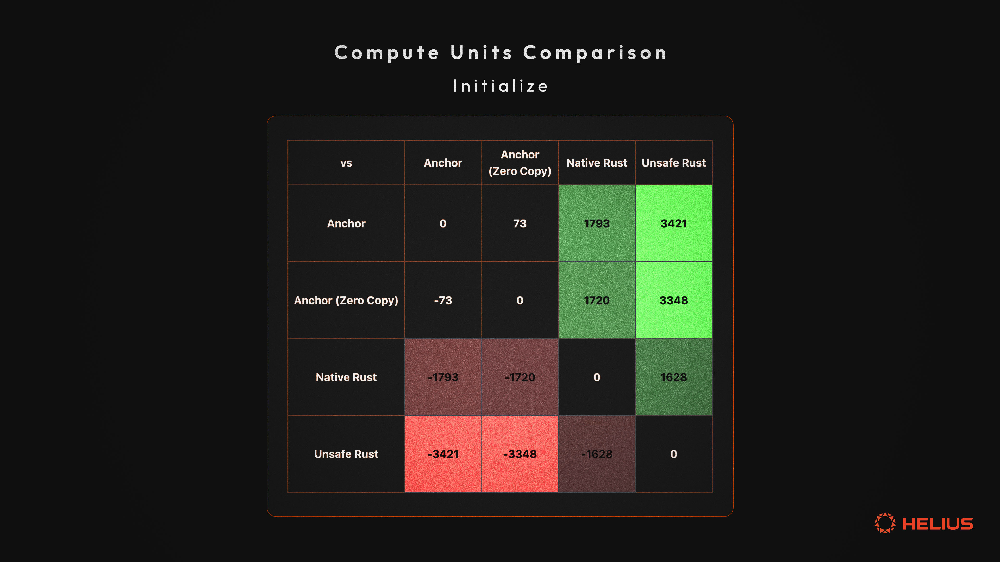

# 优化 Solana 程序

## **可执行的见解**

- 对大型数据结构和高频操作使用零拷贝反序列化
- 使用 **nostd_entrypoint** 替代 **solana_program** 的臃肿入口点
- 最小化动态内存分配，优先使用基于栈的数据结构
- 实现自定义序列化/反序列化以避免 Borsh 开销
- 使用 **#[inline(always)]** 标记关键函数以获得潜在的性能提升
- 使用位操作进行高效的指令解析
- 使用 Solana 特定的 C 系统调用，如 **sol_invoke_signed_c**
- 测量计算单元使用情况以指导优化工作

## **简介**

Solana 开发者在编写程序时面临几个决策：如何平衡易用性、性能和安全性。这个范围从用户友好的 Anchor 框架（以一些开销为代价简化开发）到使用不安全 Rust 和直接系统调用的低级方法。虽然后者提供了最高性能，但也带来了更高的复杂性和潜在的安全风险。对开发者来说，关键问题不仅是如何优化，还有何时以及优化到什么程度。

本博文深入探讨这些选项，为开发者提供一个导航优化领域的路线图。我们将研究以下抽象层次：

1. [Anchor](https://www.helius.dev/blog/an-introduction-to-anchor-a-beginners-guide-to-building-solana-programs)：大多数开发者首选的主观、强大的高级框架
2. 带有[零拷贝](https://beta.solpg.io/tutorials/zero-copy)的 Anchor：为优化大型数据结构而编写的 Anchor 代码
3. [原生 Rust](https://solana.com/developers/guides/getstarted/intro-to-native-rust)：用于平衡控制和易用性的纯 Rust
4. 带有直接[系统调用(syscalls)](https://web.archive.org/web/20231004144333/https://bpf.wtf/sol-0x04-syscalls/)的[不安全 Rust](https://doc.rust-lang.org/book/ch19-01-unsafe-rust.html)：突破性能极限

本文的目标不是提供一个放之四海而皆准的解决方案，而是让开发者具备根据具体用例做出明智编程决策的知识。

读完本文后，您将更好地理解如何思考这些不同的抽象层次，以及何时考虑走优化之路。请记住，最优化的代码并不总是最佳解决方案——关键是为您的项目需求找到正确的平衡。

本文假定您熟悉[基础 Rust](https://github.com/rust-lang/rustlings)、[Solana 的账户模型](https://solana.com/docs/core/accounts)和 [Anchor 框架](https://www.helius.dev/blog/an-introduction-to-anchor-a-beginners-guide-to-building-solana-programs)。

对于急于了解的读者：


## **计算单元**

Solana 的高性能架构依赖于高效的资源管理。在这个系统的核心是计算单元（CUs）— 一种衡量验证节点处理给定交易所消耗计算资源的度量。

## ‍**为什么要关注计算单元？**

**1. 交易成功：** 每笔交易都有 CU 限制。超出限制会导致交易失败
**2. 成本效率：** 较低的 CU 使用意味着较低的交易费用
**3. 用户体验：** 优化的程序执行更快，提升整体用户体验
**4. 可扩展性：** 高效的程序允许每个区块处理更多交易，提高网络吞吐量

## **测量计算单元**

**solana_program::log::sol_log_compute_units()** 系统调用会记录程序在执行到特定点时消耗的计算单元数量。

以下是使用该系统调用的一个简单的 compute_fn! 宏实现：

```rust
#[macro_export]
macro_rules! compute_fn {
    ($msg:expr=> $($tt:tt)*) => {
        ::solana_program::msg!(concat!($msg, " {"));
        ::solana_program::log::sol_log_compute_units();
        let res = { $($tt)* };
        ::solana_program::log::sol_log_compute_units();
        ::solana_program::msg!(concat!(" } // ", $msg));
        res
    };
}
```

这个宏来自于[ Solana 开发者 GitHub 仓库](https://github.com/solana-developers/cu_optimizations/blob/main/anchor/counter/anchor/programs/counter/src/lib.rs#L18)，用于计算单元优化。这段代码实现了一个计数器程序，包含两个指令：**initialize** 和 **increment**。

在本文中，我们将用四种不同的方式编写同样的计数器程序，包含相同的两个指令 **initialize** 和 **increment**，并比较它们的计算单元使用情况：Anchor、使用零拷贝反序列化的 Anchor、原生 Rust 和不安全 Rust。

初始化一个账户并对其进行微小修改（在本例中是递增）是比较这些不同方法的一个不错的基准。目前我们暂不使用 [PDAs](https://solana.com/docs/core/pda)。

对于急于了解结果的读者，以下是这四种方法的计算单元对比：


<p style="text-align: center">计算单元（CU）对比</p>



<p style="text-align: center">初始化指令</p>


<p style="text-align: center">递增指令</p>

让我们开始吧...

## **零拷贝反序列化**

零拷贝反序列化允许我们直接解析账户数据，无需分配新内存或复制数据。这种技术可以减少 CPU 使用、降低内存消耗，并可能带来更高效的指令。

让我们从一个基本的 Anchor 计数器程序开始：

```rust
use anchor_lang::prelude::*;

declare_id!("37oUa3WkeqwnFxSCqyMnpC3CfTSwtvyJxnwYQc3u6U7C");

#[program]
pub mod counter {
    use super::*;

    pub fn initialize(ctx: Context<Initialize>) -> Result<()> {
        let counter = &mut ctx.accounts.counter;
        counter.count = 0;
        Ok(())
    }

    pub fn increment(ctx: Context<Update>) -> Result<()> {
        let counter = &mut ctx.accounts.counter;
        //Not doing checked_add, wrapping add or any overflow checks
        //to keep it simple
        counter.count += 1;
        Ok(())
    }
}

#[derive(Accounts)]
pub struct Initialize<'info> {
    #[account(init, payer = user, space = 8 + 8)]
    pub counter: Account<'info, Counter>,
    #[account(mut)]
    pub user: Signer<'info>,
    pub system_program: Program<'info, System>,
}

#[derive(Accounts)]
pub struct Update<'info> {
    #[account(mut)]
    pub counter: Account<'info, Counter>,
    pub user: Signer<'info>,
}

#[account]
pub struct Counter {
    pub count: u64,
}
```

上面的代码很简单。现在让我们用 zero_copy 来优化它:

```rust
use anchor_lang::prelude::*;


declare_id!("7YkAh5yHbLK4uZSxjGYPsG14VUuDD6RQbK6k4k3Ji62g");


#[program]
pub mod counter {
 use super::*;

pub fn initialize(ctx: Context<Initialize>) -> Result<()> {
 let mut counter = ctx.accounts.counter.load_init()?;
 counter.count = 0;
 Ok(())
 }

pub fn increment(ctx: Context<Update>) -> Result<()> {
 let mut counter = ctx.accounts.counter.load_mut()?;
 counter.count += 1;
 Ok(())
 }
}

#[derive(Accounts)]
pub struct Initialize<'info> {
 #[account(init, payer = user, space = 8 + std::mem::size_of::<CounterData>())]
 pub counter: AccountLoader<'info, CounterData>,
 #[account(mut)]
 pub user: Signer<'info>,
 pub system_program: Program<'info, System>,
}

#[derive(Accounts)]
pub struct Update<'info> {
 #[account(mut)]
 pub counter: AccountLoader<'info, CounterData>,
 pub user: Signer<'info>,
}

#[account(zero_copy)]
pub struct CounterData {
 pub count: u64,
}
```

**主要变更:**

**1. 使用 AccountLoader 替代 Account**
我们现在使用 **AccountLoader<'info, CounterData>** 而不是 **Account<'info, Counter>**。这允许对账户数据进行零拷贝访问。

**2. Zero-Copy 属性**
**CounterData** 上的 **#[account(zero_copy)]** 属性表明这个结构体可以直接从内存中的原始字节解释。

**3. 直接数据访问**
在 **initialize** 和 **increment** 函数中，我们分别使用 **load_init()** 和 **load_mut()** 来获取账户数据的可变访问权限，而无需复制数据。

**4. 缓解重复账户漏洞**

零拷贝反序列化解决了 Borsh 序列化中存在的潜在漏洞。使用 Borsh 时，会创建和修改账户的不同副本，然后将其复制回相同的地址。如果在一个交易中多次包含相同的账户，这个过程可能导致不一致。而零拷贝直接从同一内存地址读写。这种方法确保交易中对同一账户的所有引用都操作相同的数据，消除了由重复账户导致的不一致风险。

**5. 内存布局保证**
**zero_copy** 属性确保 **CounterData** 具有一致的内存布局，允许安全地从原始字节重新解释。这种实现将 **initialize** 指令的 CU 使用量从 5095 降低到 5022，将 **increment** 指令的使用量从 1162 降低到 1124。

在我们的案例中，零拷贝带来的改进很小，基本可以忽略。但是，在处理大型数据结构时，零拷贝反序列化可能很有用。这是因为在处理存储复杂或大量数据的账户时，它可以大大减少 CPU 和内存使用。

## **权衡和注意事项**

零拷贝并非没有挑战：

**1. 增加复杂性：** 代码变得稍微复杂一些，需要谨慎处理原始数据

**2. 兼容性：** 并非所有数据结构都适合零拷贝反序列化 — 它们必须具有可预测的内存布局。例如，具有动态大小字段(如 Vec 或 String)的结构体与零拷贝反序列化不兼容。

是否使用零拷贝应该基于您的具体用例。对于像我们的计数器这样的简单程序，收益可能很小。但是，随着程序变得更加复杂并处理更大的数据结构，零拷贝可以成为优化的有力工具。

虽然零拷贝优化对我们简单的计数器程序没有带来显著改进，但对效率的追求并未止步于此。让我们探索另一条途径：不使用 Anchor 框架而用 Rust 编写原生 Solana 程序。这种方法提供了更多的控制和优化潜力，尽管会增加复杂性。

## **使用原生代码**

原生 Rust 程序提供了更底层的接口，要求开发者手动处理 Anchor 自动化的各种任务。这包括账户的反序列化、序列化和各种安全检查。虽然这对开发者提出了更高的要求，但也为精细调优优化提供了机会。

让我们来看看计数器程序的原生 Rust 实现:

```rust
use solana_program::{
    account_info::{next_account_info, AccountInfo},
    entrypoint,
    entrypoint::ProgramResult,
    program_error::ProgramError,
    pubkey::Pubkey,
    rent::Rent,
    system_instruction,
    program::invoke,
    sysvar::Sysvar,
};
use std::mem::size_of;

// Define the state struct
struct Counter {
    count: u64,
}

// Declare and export the program's entrypoint
entrypoint!(process_instruction);

// Program entrypoint's implementation
pub fn process_instruction(
    program_id: &Pubkey,
    accounts: &[AccountInfo],
    instruction_data: &[u8],
) -> ProgramResult {
    let instruction = instruction_data
        .get(0)
        .ok_or(ProgramError::InvalidInstructionData)?;

    match instruction {
        0 => initialize(program_id, accounts),
        1 => increment(accounts),
        _ => Err(ProgramError::InvalidInstructionData),
    }
}

fn initialize(program_id: &Pubkey, accounts: &[AccountInfo]) -> ProgramResult {
    let account_info_iter = &mut accounts.iter();
    let counter_account = next_account_info(account_info_iter)?;
    let user = next_account_info(account_info_iter)?;
    let system_program = next_account_info(account_info_iter)?;

    if !user.is_signer {
        return Err(ProgramError::MissingRequiredSignature);
    }

    if counter_account.owner != program_id {
        let rent = Rent::get()?;
        let space = size_of::<Counter>();
        let rent_lamports = rent.minimum_balance(space);

        invoke(
            &system_instruction::create_account(
                user.key,
                counter_account.key,
                rent_lamports,
                space as u64,
                program_id,
            ),
            &[user.clone(), counter_account.clone(), system_program.clone()],
        )?;
    }

    let mut counter_data = Counter { count: 0 };
    counter_data.serialize(&mut &mut counter_account.data.borrow_mut()[..])?;

    Ok(())
}

fn increment(accounts: &[AccountInfo]) -> ProgramResult {
    let account_info_iter = &mut accounts.iter();
    let counter_account = next_account_info(account_info_iter)?;
    let user = next_account_info(account_info_iter)?;

    if !user.is_signer {
        return Err(ProgramError::MissingRequiredSignature);
    }

    let mut counter_data = Counter::deserialize(&counter_account.data.borrow())?;

    //Not doing checked_add, wrapping add or any overflow checks to keep it simple
    counter_data.count += 1;
    counter_data.serialize(&mut &mut counter_account.data.borrow_mut()[..])?;

    Ok(())
}

impl Counter {
    fn serialize(&self, data: &mut [u8]) -> ProgramResult {
        if data.len() < size_of::<Self>() {
            return Err(ProgramError::AccountDataTooSmall);
        }

        //First 8 bytes is the count
        data[..8].copy_from_slice(&self.count.to_le_bytes());
        Ok(())
    }

    fn deserialize(data: &[u8]) -> Result<Self, ProgramError> {
        if data.len() < size_of::<Self>() {
            return Err(ProgramError::AccountDataTooSmall);
        }

        //First 8 bytes is the count
        let count = u64::from_le_bytes(data[..8].try_into().unwrap());
        Ok(Self { count })
    }
}
```

**主要区别和注意事项：**

1. **手动指令解析**
   与 Anchor 自动路由指令不同，我们需要手动解析指令数据并将其路由到相应的函数

```rust
let instruction = instruction_data
        .get(0)
        .ok_or(ProgramError::InvalidInstructionData)?;

    match instruction {
        0 => initialize(program_id, accounts),
        1 => increment(accounts),
        _ => Err(ProgramError::InvalidInstructionData),
    }
```

2. **账户管理**
   我们使用 **next_account_info** 来遍历账户，手动检查签名者和所有者。Anchor 通过其 **#[derive(Accounts)]** 宏自动处理这些工作

```rust
let account_info_iter = &mut accounts.iter();
    let counter_account = next_account_info(account_info_iter)?;
    let user = next_account_info(account_info_iter)?;

    if !user.is_signer {
        return Err(ProgramError::MissingRequiredSignature);
}
```

3. **自定义序列化：**
   我们为 **Counter** 结构体实现了自定义的 **serialize** 和 **deserialize** 方法。Anchor 默认使用 [Borsh 序列化](https://borsh.io/)，将这些细节抽象化处理

```rust
impl Counter {
    fn serialize(&self, data: &mut [u8]) -> ProgramResult {
        if data.len() < size_of::<Self>() {
            return Err(ProgramError::AccountDataTooSmall);
        }

        //First 8 bytes is the count
        data[..8].copy_from_slice(&self.count.to_le_bytes());
        Ok(())
    }

    fn deserialize(data: &[u8]) -> Result<Self, ProgramError> {
        if data.len() < size_of::<Self>() {
            return Err(ProgramError::AccountDataTooSmall);
        }

        //First 8 bytes is the count
        let count = u64::from_le_bytes(data[..8].try_into().unwrap());
        Ok(Self { count })
    }
}
```

4. **系统程序交互**
   创建账户需要使用 **invoke** 直接与[系统程序](https://docs.solanalabs.com/runtime/programs#system-program)交互并执行[跨程序调用(CPI)](https://solana.com/docs/core/cpi)，而 Anchor 通过其 init 约束简化了这个过程：

```rust
invoke(
      &system_instruction::create_account(
          user.key,
          counter_account.key,
          rent_lamports,
          space as u64,
          program_id,
      ),
      &[user.clone(), counter_account.clone(), system_program.clone()],
)?;
```

5. **细粒度控制**
   总的来说，原生程序提供了更多对数据布局和处理的控制，因为它们不遵循单一的、固定的框架，从而允许编写更优化的代码。

## **如何看待 Anchor 与原生程序的对比？**

1. **显式与隐式**
   原生程序需要显式处理许多 Anchor 隐式管理的方面，包括账户验证、序列化和指令路由

2. **安全考虑**
   没有 Anchor 的内置检查，开发者必须警惕地实现[适当的安全措施](https://www.helius.dev/blog/a-hitchhikers-guide-to-solana-program-security)，比如检查账户所有权和签名者状态

3. **性能调优**
   原生程序允许更细粒度的性能优化，但需要对 Solana 运行时行为有更深入的理解

4. **样板代码**
   对于 Anchor 抽象处理的常见操作，需要编写更多样板代码

5. **学习曲线**
   虽然可能更高效，但原生编程有更陡峭的学习曲线，需要对 Solana 架构有更深入的了解

## **总结**

从 Anchor 转向原生程序时最大的限制因素是处理序列化和反序列化。在我们的例子中，这相对简单。但是，随着状态管理变得更加复杂，这个过程也会变得越来越复杂。

然而，同样值得注意的是，Anchor 使用的 Borsh 在计算上代价很高，所以这些优化工作是值得的。

我们的优化之旅并未就此结束。在下一节中，我们将通过利用直接系统调用并避免使用 Rust 标准库来进一步突破性能极限。

这种方法具有挑战性，但我保证它将为您提供一些关于 Solana 运行时内部工作原理的有趣见解。

## **使用不安全 Rust 和直接系统调用突破极限**

为了将我们的计数器程序性能推向极限，我们现在将探索使用不安全 Rust 和直接系统调用。不安全 Rust 允许开发者绕过标准安全检查，实现直接内存操作和低级优化。同时，系统调用提供了直接访问 Solana 运行时的接口。这种方法虽然复杂且需要细致的开发，但可以带来显著的计算单元节省。然而，它也需要对 Solana 架构有更深入的理解，并且需要格外注意程序安全性。虽然潜在的性能提升很大，但也带来了更多的责任。

让我们来看看利用这些高级技术的高度优化版本计数器程序：

```rust
use solana_nostd_entrypoint::{
    basic_panic_impl, entrypoint_nostd, noalloc_allocator,
    solana_program::{
        entrypoint::ProgramResult, log, program_error::ProgramError, pubkey::Pubkey, system_program,
    },
    InstructionC, NoStdAccountInfo,
};

entrypoint_nostd!(process_instruction, 32);

pub const ID: Pubkey = solana_nostd_entrypoint::solana_program::pubkey!(
    "EgB1zom79Ek4LkvJjafbkUMTwDK9sZQKEzNnrNFHpHHz"
);

noalloc_allocator!();
basic_panic_impl!();

const ACCOUNT_DATA_LEN: usize = 8; // 8 bytes for u64 counter

/*
 * Program Entrypoint
 * ------------------
 * Entrypoint receives:
 * - program_id: The public key of the program's account
 * - accounts: An array of accounts required for the instruction
 * - instruction_data: A byte array containing the instruction data
 *
 * Instruction data format:
 * ------------------------
 * | Bit 0 | Bits 1-7 |
 * |-------|----------|
 * |  0/1  |  Unused  |
 *
 * 0: Initialize
 * 1: Increment
 */
#[inline(always)]
pub fn process_instruction(
    _program_id: &Pubkey,
    accounts: &[NoStdAccountInfo],
    instruction_data: &[u8],
) -> ProgramResult {

    if instruction_data.is_empty() {
        return Err(ProgramError::InvalidInstructionData);
    }

    // Use the least significant bit to determine the instruction
    match instruction_data[0] & 1 {
        0 => initialize(accounts),
        1 => increment(accounts),
        _ => unreachable!(),
    }
}

/*
 * Initialize Function
 * -------------------
 * This function initializes a new counter account.
 *
 * Account structure:
 * ------------------
 * 1. Payer account (signer, writable)
 * 2. Counter account (writable)
 * 3. System program
 *
 * Memory layout of instruction_data:
 * -----------------------------------------
 * | Bytes    | Content                     |
 * |----------|----------------------------|
 * | 0-3      | Instruction discriminator  |
 * | 4-11     | Required lamports (u64)    |
 * | 12-19    | Space (u64)                |
 * | 20-51    | Program ID                 |
 * | 52-55    | Unused                     |
 */
#[inline(always)]
fn initialize(accounts: &[NoStdAccountInfo]) -> ProgramResult {

    let [payer, counter, system_program] = match accounts {
        [payer, counter, system_program, ..] => [payer, counter, system_program],
        _ => return Err(ProgramError::NotEnoughAccountKeys),
    };

    if counter.key() == &system_program::ID {
        return Err(ProgramError::InvalidAccountData);
    }

    let rent = solana_program::rent::Rent::default();
    let required_lamports = rent.minimum_balance(ACCOUNT_DATA_LEN);

    let mut instruction_data = [0u8; 56];
    instruction_data[4..12].copy_from_slice(&required_lamports.to_le_bytes());
    instruction_data[12..20].copy_from_slice(&(ACCOUNT_DATA_LEN as u64).to_le_bytes());
    instruction_data[20..52].copy_from_slice(ID.as_ref());

    let instruction_accounts = [
        payer.to_meta_c(),
        counter.to_meta_c(),
    ];

    let instruction = InstructionC {
        program_id: &system_program::ID,
        accounts: instruction_accounts.as_ptr(),
        accounts_len: instruction_accounts.len() as u64,
        data: instruction_data.as_ptr(),
        data_len: instruction_data.len() as u64,
    };

    let infos = [payer.to_info_c(), counter.to_info_c()];

    // Invoke system program to create account
    #[cfg(target_os = "solana")]
    unsafe {
        solana_program::syscalls::sol_invoke_signed_c(
            &instruction as *const InstructionC as *const u8,
            infos.as_ptr() as *const u8,
            infos.len() as u64,
            std::ptr::null(),
            0,
        );
    }

    // Initialize counter to 0
    let mut counter_data = counter.try_borrow_mut_data().ok_or(ProgramError::AccountBorrowFailed)?;
    counter_data[..8].copy_from_slice(&0u64.to_le_bytes());

    Ok(())
}

/*
 * Increment Function
 * ------------------
 * This function increments the counter in the counter account.
 *
 * Account structure:
 * ------------------
 * 1. Counter account (writable)
 * 2. Payer account (signer)
 *
 * Counter account data layout:
 * ----------------------------
 * | Bytes | Content        |
 * |-------|----------------|
 * | 0-7   | Counter (u64)  |
 */
#[inline(always)]
fn increment(accounts: &[NoStdAccountInfo]) -> ProgramResult {

    let [counter, payer] = match accounts {
        [counter, payer, ..] => [counter, payer],
        _ => return Err(ProgramError::NotEnoughAccountKeys),
    };

    if !payer.is_signer() || counter.owner() != &ID {
        return Err(ProgramError::IllegalOwner);
    }

    let mut counter_data = counter.try_borrow_mut_data().ok_or(ProgramError::AccountBorrowFailed)?;

    if counter_data.len() != 8 {
        return Err(ProgramError::UninitializedAccount);
    }

    let mut value = u64::from_le_bytes(counter_data[..8].try_into().unwrap());
    value += 1;
    counter_data[..8].copy_from_slice(&value.to_le_bytes());

    Ok(())
}
```

## **主要区别和优化：**

**1. 无标准库环境**

我们使用 solana_nostd_entrypoint，它提供了一个无标准库环境。这消除了 Rust 标准库的开销，减小了程序大小并可能提高性能。感谢 [cavemanloverboy](https://x.com/cavemanloverboy) 和他的 GitHub 仓库 [Solana 程序的无标准库入口点](https://github.com/cavemanloverboy/solana-nostd-entrypoint)。

**2. 内联函数**
关键函数使用 #[inline(always)] 标记。内联是一种编译器优化，它将函数体插入到调用位置，消除了函数调用开销。这可以带来更快的执行速度，特别是对于小型的、经常调用的函数。

**3. 指令解析的位操作**
我们使用[位操作](https://en.wikipedia.org/wiki/Bit_manipulation) **instruction_data[0] & 1** 来确定指令类型，这比其他解析方法更高效：

```rust
// Use the least significant bit to determine the instruction
    match instruction_data[0] & 1 {
        0 => initialize(accounts),
        1 => increment(accounts),
        _ => unreachable!(),
 }
```

**4. 零成本内存管理和最小化异常处理**

**noalloc_allocator!** 和 **basic_panic_impl!** 宏实现了最小化的、零开销的内存管理和异常处理：

**noalloc_allocator!** 定义了一个自定义分配器，它在任何分配尝试时都会触发异常(panic)，而在释放内存时不做任何操作。将其设置为 Solana 程序的全局分配器可以有效防止运行时的任何动态内存分配：

```rust
#[macro_export]
macro_rules! noalloc_allocator {
    () => {
        pub mod allocator {
            pub struct NoAlloc;
            extern crate alloc;
            unsafe impl alloc::alloc::GlobalAlloc for NoAlloc {
                #[inline]
                unsafe fn alloc(&self, _: core::alloc::Layout) -> *mut u8 {
                    panic!("no_alloc :)");
                }
                #[inline]
                unsafe fn dealloc(&self, _: *mut u8, _: core::alloc::Layout) {}
            }

            #[cfg(target_os = "solana")]
            #[global_allocator]
            static A: NoAlloc = NoAlloc;
        }
    };
}
```

这一点很重要，因为：

a) 它消除了内存分配和释放操作的开销

b) 它迫使开发者使用基于栈或静态内存，这通常在性能方面更快且更可预测

c) 它减少了程序的内存占用

**basic_panic_impl!** 提供了一个最小的异常处理程序，它只是简单地记录一条"panicked!"消息：

```rust
#[macro_export]
macro_rules! basic_panic_impl {
    () => {
        #[cfg(target_os = "solana")]
        #[no_mangle]
        fn custom_panic(_info: &core::panic::PanicInfo<'_>) {
            log::sol_log("panicked!");
        }
    };
}
```

**5. 高效的 CPI 准备**

**InstructionC** 结构体以及 **to_meta_c** 和 **to_info_c** 函数提供了一种低级且高效的方式来准备 CPI 数据：

```rust
let instruction_accounts = [
        payer.to_meta_c(),
        counter.to_meta_c(),
    ];

    let instruction = InstructionC {
        program_id: &system_program::ID,
        accounts: instruction_accounts.as_ptr(),
        accounts_len: instruction_accounts.len() as u64,
        data: instruction_data.as_ptr(),
        data_len: instruction_data.len() as u64,
 	};

 let infos = [payer.to_info_c(), counter.to_info_c()
];
```

这些函数创建可以直接传递给 **sol_invoke_signed_c** 系统调用的 C 兼容结构。通过避免 Rust 高级抽象的开销，直接使用原始指针和 C 兼容结构，这些函数最小化了准备 CPI 的计算成本。这种方法通过减少使用更抽象的 Rust 类型时通常会发生的内存分配、复制和转换来节省计算单元。

例如，**to_info_c** 方法使用[直接指针运算](https://codedamn.com/news/c/what-is-pointer-arithmetic-in-c)高效地构造 **AccountInfoC** 结构体：

```rust
pub fn to_info_c(&self) -> AccountInfoC {
  AccountInfoC {
  key: offset(self.inner, 8),
  lamports: offset(self.inner, 72),
  data_len: self.data_len() as u64,
  data: offset(self.inner, 88),
  owner: offset(self.inner, 40),
  // … other fields …
  }
}
```

这种直接操作内存布局的方式允许极其高效地创建 CPI 所需的结构体，从而降低了这些操作的计算单元成本。

**6. 直接系统调用和不安全 Rust**

这种方法绕过了常规的 Rust 抽象，直接与 Solana 运行时交互，提供了显著的性能优势。然而，它也带来了复杂性，需要谨慎处理不安全 Rust：

```rust
// Invoke system program to create account
#[cfg(target_os = "solana")]
unsafe {
    solana_program::syscalls::sol_invoke_signed_c(
        &instruction as *const InstructionC as *const u8,
        infos.as_ptr() as *const u8,
        infos.len() as u64,
        std::ptr::null(),
        0,
    );
}
```

**7. 条件编译：**

**#[cfg(target_os = "solana")]** 属性确保代码仅在针对 Solana 运行时编译时才会编译，这是必要的，因为这些系统调用仅在该环境中可用。

**不安全 Rust 的潜在问题**

虽然功能强大，但如果处理不当，不安全的 Rust 可能会导致严重问题：

- 内存泄漏和损坏
- 未定义行为
- 竞态条件

## **不安全 Rust 的潜在问题**

虽然功能强大，但如果处理不当，不安全的 Rust 可能会导致严重问题：

- 未定义行为
- 竞态条件

为了降低使用不安全 Rust 的风险：

- 谨慎使用不安全代码块，仅在必要时使用
- 记录所有安全假设和不变量
- 使用 [Miri](https://github.com/rust-lang/miri) 和 Rust 内置的[sanitizers](https://doc.rust-lang.org/stable/unstable-book/compiler-flags/sanitizer.html)进行测试
- 考虑对关键部分使用形式化验证技术
- 对不安全代码块进行彻底的代码审查

## **总结**

虽然这些优化方法很吸引人，但在生产环境中使用这种高度优化的方法来保护真实资金是一个难以权衡的选择，因为它增加了复杂性、潜在错误和维护难度。对于大多数应用来说，引入关键 bug 的风险往往超过了性能优化带来的收益。

使用这种方法很可能会让你陷入过早优化的陷阱。


然而，有些优化方法很容易复制：

1. 使用 **nostd_entrypoint** 替代 **solana_program** 的臃肿入口点
2. 尽可能使用内联函数
3. 最小化动态内存分配，优先使用基于栈的数据结构

## **总结**

本文探讨了 Solana 程序的各种优化层次，从高级的 Anchor 开发到使用直接系统调用的低级不安全 Rust。我们看到每种方法在易用性、安全性和性能之间都有不同的权衡。

主要要点：

- Anchor 提供了一个用户友好的框架，但有一些性能开销
- 零拷贝反序列化可以显著提高大型数据结构的效率
- 原生 Rust 提供了更多控制和优化的可能性
- 不安全 Rust 和直接系统调用提供最大性能，但增加了复杂性和风险

优化层次的选择取决于您的具体用例、性能要求和风险承受能力。始终要衡量优化的影响，并考虑您的选择对长期维护的影响。

**其他资源**

- [Solana 开发者 GitHub](https://github.com/solana-developers)
- [Anchor 文档](https://docs.rs/anchor-lang/latest/anchor_lang/)
- [Solana 编程模型](https://docs.solana.com/developing/programming-model/overview)
- [Rust 性能手册](https://nnethercote.github.io/perf-book/)
- [如何优化 Solana 的计算使用](https://solana.com/developers/guides/advanced/how-to-optimize-compute)
- [如何在 Solana 上落地交易](https://www.helius.dev/blog/how-to-land-transactions-on-solana)
